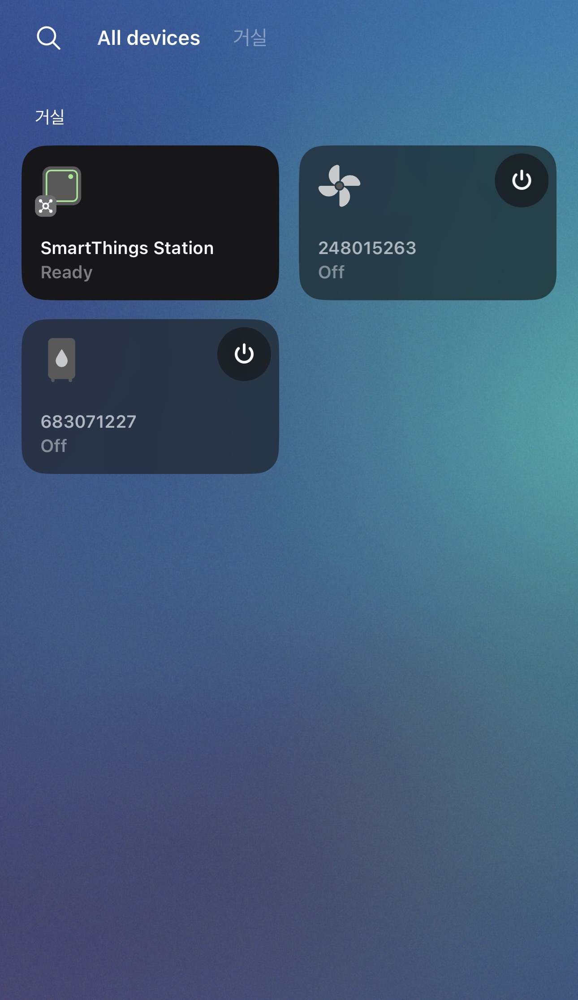
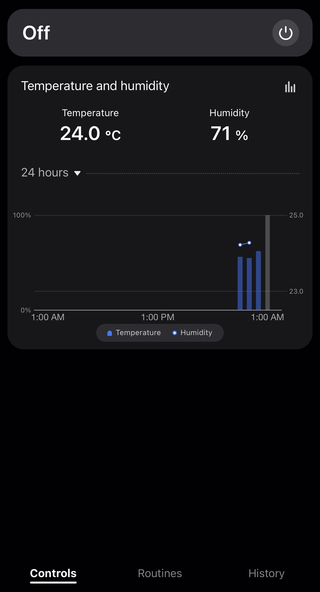
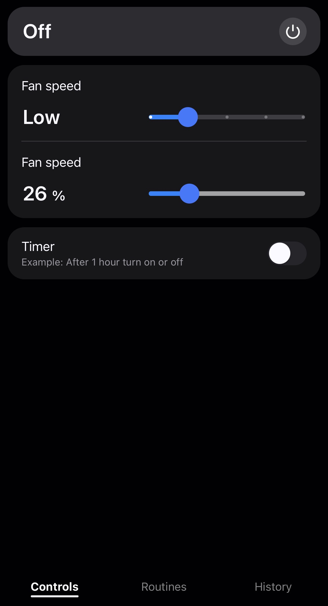

# Xiaomi MIoT Edge Driver
Connect Xiaomi devices that use the miIO and MIoT protocol to SmartThings with this Edge Driver.

## Contribution & Notes
Contributions are welcome!  
I only own two Xiaomi devices; others were implemented using open-source references. As a result, some devices may not function as expected.  
If you experience any issues, please report them through GitHub.

### ⚠️ Alpha Version Notice
This driver is currently in **alpha stage** and is intended for testing and improvement.

Keep the following in mind:
- Some devices may not be discovered.
- Even if a model is listed, its properties may not match, causing control or status updates to fail.
- Features and behavior can vary between device models.

If you find any issues or missing features, please report them via GitHub issues.

---

## Supported Devices

For a list of supported Xiaomi devices, please refer to [SUPPORTED_DEVICES.md](./SUPPORTED_DEVICES.md).

---

## Installation Guide

If your Xiaomi device is already added to the **Mi Home app**, the Edge Driver will discover it automatically over the local network using **UDP scanning**.

Before starting, you will need:
- A **token** for each device
- The **same Wi-Fi network** for both the Xiaomi device and your SmartThings Hub

To get device tokens, you can use:  
https://github.com/ApplY3D/mi-home-toolkit

---

### Steps

#### 1. Device Setup
- Register your device in the **Mi Home app**.
- Ensure the device and SmartThings Hub are on the **same local network**.
- Configure your router to assign a **static IP address** to your Xiaomi device.

#### 2. Discover Devices in SmartThings
1. Open the SmartThings app
2. Go to **Home → Add device → Scan nearby**
3. Even if nothing appears, wait about 10 seconds
4. Return to **Home → Devices**
   - Your Xiaomi devices should now be listed

> The device label will match its **miIO/MIoT Device ID**.

#### 3. Enter the Token
1. Open **Mi Home Toolkit** and log in  
2. Find the device — the ID matches the SmartThings label  
3. In SmartThings:
   - Open the device  
   - Go to **Settings**  
   - Enter the matching token

#### 4. Activation
- Once a valid token is entered, the device profile updates automatically
- The device becomes controllable and starts reporting status

#### 5. Finished!
- The status refresh interval is set to **every 30 seconds**

---

## Example







---

## Debugging & Issue Reporting

When reporting an issue, please include **both** of the following:

### 1) Collect Logs (SmartThings CLI)
```bash
smartthings edge:drivers:logcat
```

- Select the **Xiaomi miIO/MIoT** driver
- Reproduce the issue and copy the logs

### 2) Attach MIoT Spec Link

Find your device model on:  
https://home.miot-spec.com/

Example:  
https://home.miot-spec.com/spec/dmaker.fan.p11

> ⚠️ Do not include tokens, IP addresses, MAC addresses, or any personal data.

---

## References
- https://github.com/ApplY3D/mi-home-toolkit  
- https://github.com/al-one/hass-xiaomi-miot

---

## License
This project is licensed under the Apache License 2.0 — see the [LICENSE](./LICENSE) file for details.